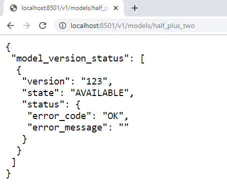

PS C:\Users\Test> docker pull tensorflow/serving

Using default tag: latest
latest: Pulling from tensorflow/serving
22e816666fd6: Pull complete
079b6d2a1e53: Pull complete 
11048ebae908: Pull complete                                                                                                             
c58094023a2e: Pull complete                                                                                                             
4dee0153a839: Pull complete                                                                                                             
90850b98765d: Pull complete                                                                                                             
de0a35913cb5: Pull complete                                                                                                             
91e09abfcd7f: Pull complete                                                                                                             
Digest: sha256:091c1d0440815e250114a6d0232ad3cb1d320c64b1ebb75ed8a80184fc25482d
Status: Downloaded newer image for tensorflow/serving:latest
docker.io/tensorflow/serving:latest

$ git clone https://github.com/tensorflow/serving

Cloning into 'serving'...
remote: Enumerating objects: 54, done.
remote: Counting objects: 100% (54/54), done.
remote: Compressing objects: 100% (52/52), done.
Receiving objects:  48% (9475/19738), 3.61 MiB | 195.00 KiB/s
remote: Total 19738 (delta 36), reused 20 (delta 2), pack-reused 19684
Receiving objects: 100% (19738/19738), 5.22 MiB | 178.00 KiB/s, done.
Resolving deltas: 100% (14964/14964), done.

PS E:\git_portable> docker run -t --rm -p 8501:8501 -v "E:\git_portable\serving\tensorflow_serving\servables\tensorflow\testdata\saved_model_half_plus_two_cpu:/models/half_plus_two" -e MODEL_NAME=half_plus_two tensorflow/serving

2019-11-10 07:11:17.037045: I tensorflow_serving/model_servers/server.cc:85] Building single TensorFlow model file config:  model_name: half_plus_two model_base_path: /models/half_plus_two
2019-11-10 07:11:17.037797: I tensorflow_serving/model_servers/server_core.cc:462] Adding/updating models.
2019-11-10 07:11:17.037861: I tensorflow_serving/model_servers/server_core.cc:573]  (Re-)adding model: half_plus_two
2019-11-10 07:11:17.158245: I tensorflow_serving/core/basic_manager.cc:739] Successfully reserved resources to load servable {name: half_plus_two version: 123}
2019-11-10 07:11:17.158435: I tensorflow_serving/core/loader_harness.cc:66] Approving load for servable version {name: half_plus_two version: 123}
2019-11-10 07:11:17.158496: I tensorflow_serving/core/loader_harness.cc:74] Loading servable version {name: half_plus_two version: 123}
2019-11-10 07:11:17.158573: I external/org_tensorflow/tensorflow/cc/saved_model/reader.cc:31] Reading SavedModel from: /models/half_plus_two/00000123
2019-11-10 07:11:17.170610: I external/org_tensorflow/tensorflow/cc/saved_model/reader.cc:54] Reading meta graph with tags { serve }
2019-11-10 07:11:17.172642: I external/org_tensorflow/tensorflow/core/platform/cpu_feature_guard.cc:142] Your CPU supports instructions that this TensorFlow binary was not compiled to use: AVX2 FMA
2019-11-10 07:11:17.212202: I external/org_tensorflow/tensorflow/cc/saved_model/loader.cc:202] Restoring SavedModel bundle.
2019-11-10 07:11:17.230431: I external/org_tensorflow/tensorflow/cc/saved_model/loader.cc:151] Running initialization op on SavedModel bundle at path: /models/half_plus_two/00000123
2019-11-10 07:11:17.236016: I external/org_tensorflow/tensorflow/cc/saved_model/loader.cc:311] SavedModel load for tags { serve }; Status: success. Took 77445 microseconds.
2019-11-10 07:11:17.237262: I tensorflow_serving/servables/tensorflow/saved_model_warmup.cc:105] No warmup data file found at /models/half_plus_two/00000123/assets.extra/tf_serving_warmup_requests
2019-11-10 07:11:17.247605: I tensorflow_serving/core/loader_harness.cc:87] Successfully loaded servable version {name: half_plus_two version: 123}
2019-11-10 07:11:17.250931: I tensorflow_serving/model_servers/server.cc:353] Running gRPC ModelServer at 0.0.0.0:8500 ...
[warn] getaddrinfo: address family for nodename not supported
2019-11-10 07:11:17.252948: I tensorflow_serving/model_servers/server.cc:373] Exporting HTTP/REST API at:localhost:8501 ...

PS E:\git_portable> docker ps

CONTAINER ID        IMAGE                                                    COMMAND                  CREATED             STATUS              PORTS                              NAMES
c6e0b94c10b9        tensorflow/tensorflow:2.0.0-py3-jupyter-pandas-sklearn   "bash -c 'source /et…"   2 hours ago         Up 2 hours          0.0.0.0:8888->8888/tcp             tensorflow2
c0a477f441fb        tensorflow/serving                                       "/usr/bin/tf_serving…"   2 hours ago         Up 2 hours          8500/tcp, 0.0.0.0:8501->8501/tcp   hungry_robinson

PS E:\git_portable> curl -d '{"instances": [1.0, 2.0, 5.0]}' -X POST http://localhost:8501/v1/models/half_plus_two:predict
Invoke-WebRequest : A parameter cannot be found that matches parameter name 'X'.
At line:1 char:42
+ curl -d '{"instances": [1.0, 2.0, 5.0]}' -X POST http://localhost:850 ...
    + CategoryInfo          : InvalidArgument: (:) [Invoke-WebRequest], ParameterBindingException
    + FullyQualifiedErrorId : NamedParameterNotFound,Microsoft.PowerShell.Commands.InvokeWebRequestCommand

